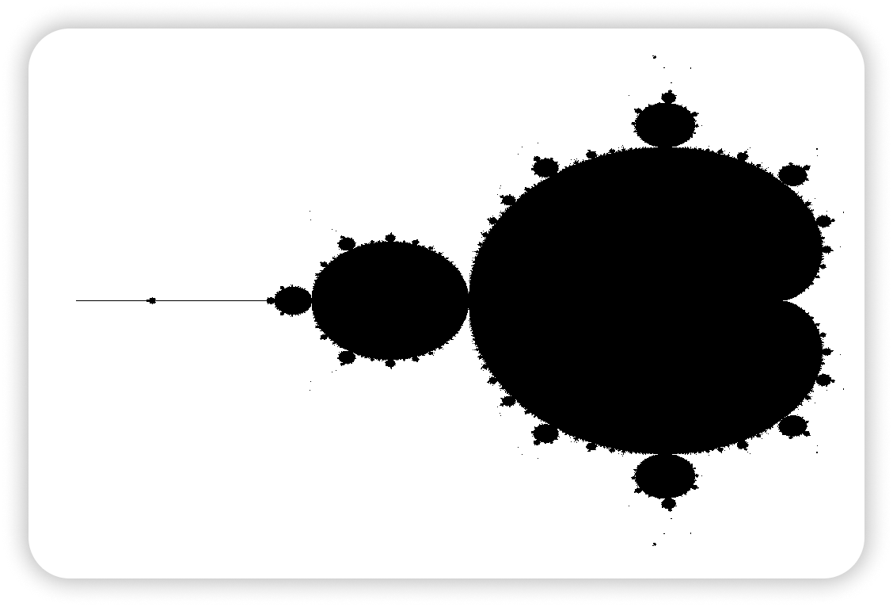

# Mandelbrot

[Mandelbrot] set renderer.
The following features/dependencies are used: 
- [SIMD Intel instructions]
- [SDL2] library 

[Mandelbrot]: https://en.wikipedia.org/wiki/Plotting_algorithms_for_the_Mandelbrot_set
[SDL2]:       https://www.libsdl.org/download-2.0.php
[SIMD Intel instructions]: https://www.intel.com/content/www/us/en/docs/intrinsics-guide/index.html

## License
MIT
